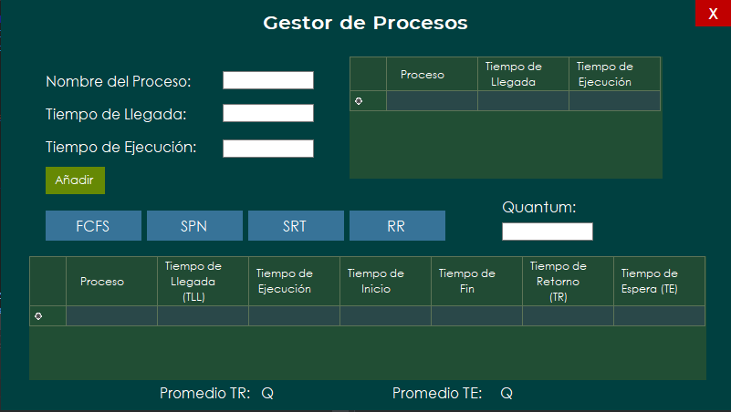
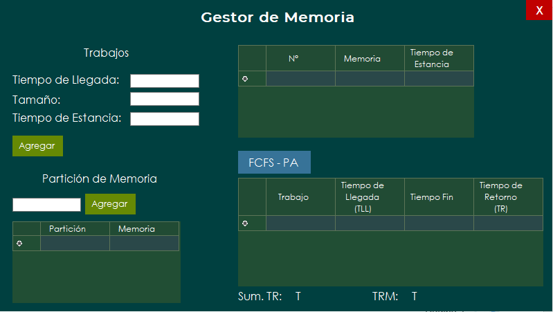

# Planificador de Procesos y Memoria
Autor: Erick Godoy

## Caracteristicas
-	Lenguaje de Programación: C#
-	Entorno de Desarrollo Integrado (IDE): Visual Studio 2019

## Interfaz 
- Ventana de Gestión de Procesos.

En esta ventana podremos ingresar los datos de los procesos en cola y escoger con que política de planificación se realizara la gestión de procesos: 

    - First Come First Served (FCFS
    - Shorest Process Next (SPN)
    - Short Remaining Time (SRT)
    - Round Robin (RR)

- Ventana de Gestión de Memoria.

En esta ventana podremos ingresar las particiones que requiera la memoria y también los datos de los trabajos.
Se cuenta con la opción de realizar la gestión de memoria usando la política de planificación First Come First Served (FCFS) y la técnica de Primer Ajuste (PA).

